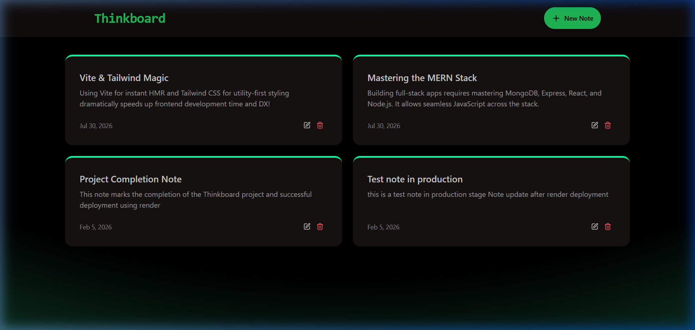
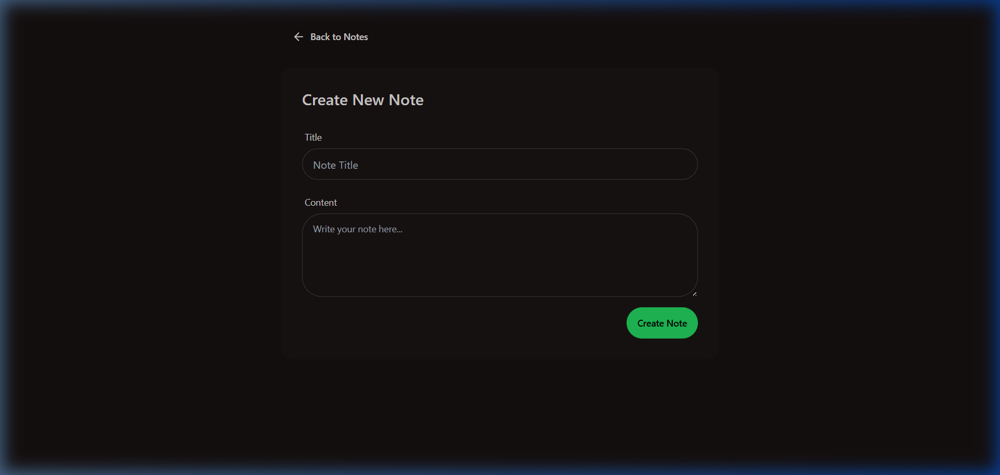
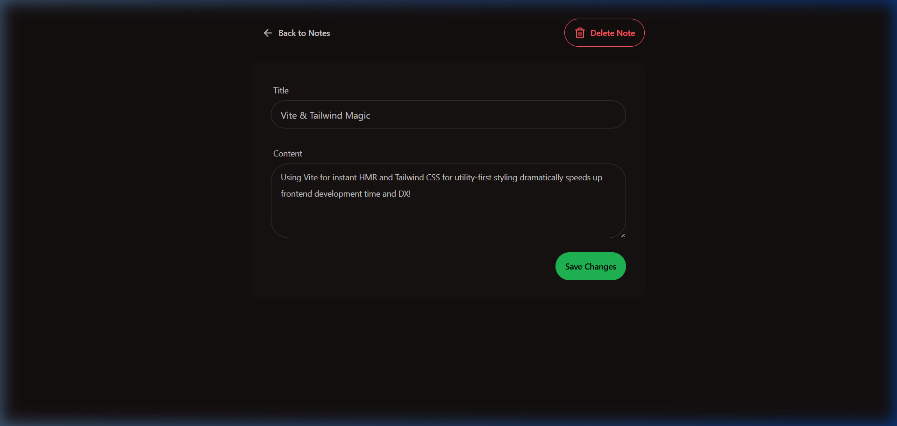

<p align="center">
  <h1 align="center">📝 ThinkBoard</h1>
  <h3 align="center">A Full-Stack Notes Application Built with the MERN Stack</h3>
</p>

<p align="center">
  <a href="https://thinkboard-ps97.onrender.com">
    
  </a>
</p>

<p align="center">
  
  
  
  
  
  
  
  
</p>

---

## 📸 Screenshots

### Homepage — Notes Grid



### Create New Note



### Edit & Delete Note



---

## ✨ Features

- **Full CRUD Operations** — Create, Read, Update, and Delete notes seamlessly
- **RESTful API** — Clean, well-structured API endpoints following REST conventions
- **IP-Based Rate Limiting** — Redis-powered sliding window rate limiter (100 requests/60s per IP) using Upstash
- **Production-Ready Deployment** — Static React frontend served from Express in production via same-origin architecture
- **Responsive Dark UI** — Modern dark theme built with Tailwind CSS and DaisyUI
- **Real-Time Feedback** — Toast notifications for all user actions via react-hot-toast

---

## 🏗️ Architecture

```
┌─────────────────────────────────────────────────────────────────────┐
│                         CLIENT (Browser)                            │
│                     React SPA + React Router                        │
│              Axios HTTP Requests ──► /api/notes/*                   │
└────────────────────────────┬────────────────────────────────────────┘
                             │
                             ▼
┌─────────────────────────────────────────────────────────────────────┐
│                       EXPRESS SERVER (Node.js)                       │
│                                                                     │
│  ┌──────────────┐   ┌──────────────────┐   ┌────────────────────┐  │
│  │   CORS       │──►│  Rate Limiter    │──►│  JSON Body Parser  │  │
│  │  Middleware   │   │  (Upstash Redis) │   │    Middleware       │  │
│  └──────────────┘   └──────────────────┘   └────────────────────┘  │
│                             │                                       │
│                             ▼                                       │
│              ┌──────────────────────────────┐                       │
│              │     Routes → Controllers     │                       │
│              │  GET    /api/notes           │                       │
│              │  GET    /api/notes/:id       │                       │
│              │  POST   /api/notes           │                       │
│              │  PUT    /api/notes/:id       │                       │
│              │  DELETE /api/notes/:id       │                       │
│              └──────────────┬───────────────┘                       │
│                             │                                       │
└─────────────────────────────┼───────────────────────────────────────┘
                              │
              ┌───────────────┼───────────────┐
              ▼                               ▼
┌──────────────────────┐       ┌──────────────────────────┐
│    MongoDB Atlas      │       │     Upstash Redis         │
│   (Data Persistence)  │       │  (Rate Limit Counters)    │
│                       │       │  Sliding Window: 100/60s  │
│   Collection: notes   │       │  Key: Client IP Address   │
└──────────────────────┘       └──────────────────────────┘
```

---

## 📂 Project Structure

```
MERN-Thinkboard/
├── backend/
│   ├── src/
│   │   ├── config/
│   │   │   ├── db.js              # MongoDB connection with Mongoose
│   │   │   └── upstash.js         # Upstash Redis rate limiter config
│   │   ├── controllers/
│   │   │   └── notesController.js # CRUD business logic
│   │   ├── middleware/
│   │   │   └── rateLimiter.js     # IP-based rate limiting middleware
│   │   ├── models/
│   │   │   └── Note.js            # Mongoose schema (title, content, timestamps)
│   │   ├── routes/
│   │   │   └── notesRoutes.js     # RESTful route definitions
│   │   └── server.js              # Express app entry point
│   ├── package.json
│   └── .env                       # Environment variables (not tracked)
│
├── frontend/
│   ├── src/
│   │   ├── components/
│   │   │   ├── Navbar.jsx         # Top navigation bar
│   │   │   ├── NoteCard.jsx       # Individual note card component
│   │   │   ├── NotesNotFound.jsx  # Empty state UI
│   │   │   └── RateLimitedUI.jsx  # 429 error feedback component
│   │   ├── pages/
│   │   │   ├── HomePage.jsx       # Notes grid display
│   │   │   ├── CreatePage.jsx     # New note form
│   │   │   └── NoteDetailPage.jsx # Edit/Delete note view
│   │   ├── lib/
│   │   │   └── axios.js           # Axios instance configuration
│   │   ├── App.jsx                # React Router configuration
│   │   └── main.jsx               # React entry point
│   ├── index.html
│   └── package.json
│
├── package.json                    # Root-level build/start scripts
├── screenshots/                    # App screenshots
└── README.md
```

---

## 🛠️ Tech Stack

| Layer | Technology | Purpose |
|-------|-----------|---------|
| **Frontend** | React 19 | UI component library |
| **Routing** | React Router 7 | Client-side SPA navigation |
| **Styling** | Tailwind CSS + DaisyUI | Utility-first CSS with pre-built dark theme |
| **Bundler** | Vite (Rolldown) | Lightning-fast HMR and optimized production builds |
| **HTTP** | Axios | Promise-based HTTP client for API calls |
| **Backend** | Express.js | Minimal Node.js web framework |
| **Database** | MongoDB Atlas + Mongoose | Cloud-hosted NoSQL database with ODM |
| **Caching** | Upstash Redis | Serverless Redis for IP-based rate limiting |
| **Deploy** | Render | Cloud platform with auto-deploy from GitHub |

---

## 🔌 API Reference

All endpoints are prefixed with `/api/notes`

| Method | Endpoint | Description | Status Codes |
|--------|----------|-------------|-------------|
| `GET` | `/api/notes` | Fetch all notes | `200` `500` |
| `GET` | `/api/notes/:id` | Fetch a note by ID | `200` `404` `500` |
| `POST` | `/api/notes` | Create a new note | `201` `500` |
| `PUT` | `/api/notes/:id` | Update a note by ID | `200` `404` `500` |
| `DELETE` | `/api/notes/:id` | Delete a note by ID | `200` `404` `500` |

> **Rate Limit:** All endpoints are protected by a sliding window rate limiter — **100 requests per 60 seconds per IP address**. Exceeding this limit returns `429 Too Many Requests`.

---

## 🔒 Security

- **IP-Based Rate Limiting** — Upstash Redis sliding window algorithm tracks requests per unique client IP, preventing API abuse while ensuring legitimate users are unaffected
- **CORS Protection** — Cross-Origin Resource Sharing restricted to localhost:5173 in development; disabled in production (same-origin serving)
- **Environment Variables** — All secrets (MONGO_URI, Redis tokens) stored in .env and excluded via .gitignore
- **Same-Origin Production** — React static bundle served directly from Express, eliminating cross-origin attack vectors entirely

---

## 🚀 Getting Started

### Prerequisites

- [Node.js](https://nodejs.org/) (v18+)
- [MongoDB Atlas](https://www.mongodb.com/atlas) account (free tier)
- [Upstash](https://upstash.com/) account (free tier Redis)

### 1. Clone the Repository

```bash
git clone https://github.com/AnujMalviya2154/MERN-Thinkboard.git
cd MERN-Thinkboard
```

### 2. Configure Environment Variables

Create a `.env` file inside the `backend/` directory:

```env
MONGO_URI=your_mongodb_atlas_connection_string
PORT=5001
UPSTASH_REDIS_REST_URL=your_upstash_redis_url
UPSTASH_REDIS_REST_TOKEN=your_upstash_redis_token
NODE_ENV=development
```

### 3. Install Dependencies and Run

```bash
# Install backend dependencies
npm install --prefix backend

# Install frontend dependencies
npm install --prefix frontend

# Start backend (from root)
npm run start --prefix backend

# Start frontend (in a new terminal, from root)
npm run dev --prefix frontend
```

The backend runs on `http://localhost:5001` and the frontend on `http://localhost:5173`.

---

## ☁️ Deployment (Render)

This application is deployed as a single **Web Service** on Render with same-origin architecture.

| Setting | Value |
|---------|-------|
| **Build Command** | `npm run build` (runs root package.json: installs backend, installs frontend, builds Vite) |
| **Start Command** | `npm run start` (starts Express which serves the compiled React frontend) |

### Environment Variables on Render

| Key | Value |
|-----|-------|
| `MONGO_URI` | Your MongoDB Atlas connection URI |
| `UPSTASH_REDIS_REST_URL` | Your Upstash Redis REST URL |
| `UPSTASH_REDIS_REST_TOKEN` | Your Upstash Redis REST Token |
| `NODE_ENV` | `production` |

> **Note:** Do **not** set `PORT` on Render. Render dynamically assigns its own port, and the Express server picks it up automatically via `process.env.PORT || 5001`.

---

## 📄 License

This project is licensed under the [ISC License](./LICENSE).

---

**Built with ❤️ by [Anuj Malviya](https://github.com/AnujMalviya2154)**
